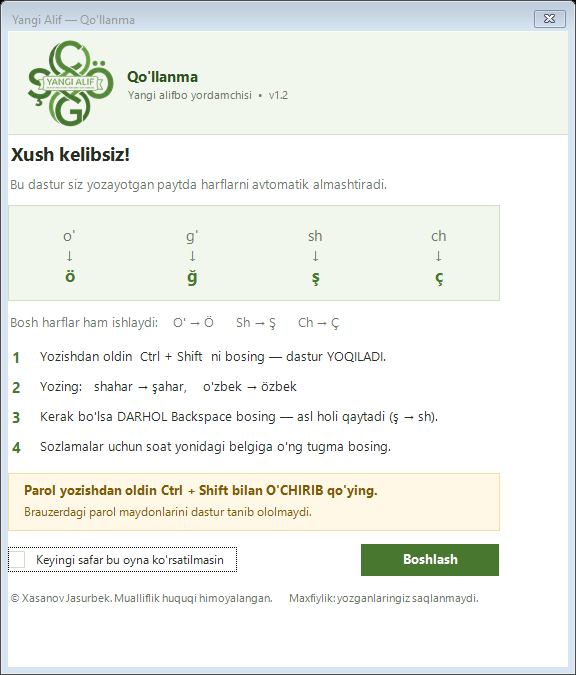

# Yangi Alif

**Yangi alifbo yordamchisi — Windows uchun**

Siz yozayotgan paytda harflarni avtomatik almashtiradi:

| Yozasiz | Chiqadi |
|---------|---------|
| `o'`    | `ö`     |
| `g'`    | `ğ`     |
| `sh`    | `ş`     |
| `ch`    | `ç`     |

Bosh harflar ham ishlaydi: `O' → Ö`, `Sh → Ş`, `Ch → Ç`

### ⬇ Yuklab olish

**[Eng so'nggi versiyani yuklab olish →](https://github.com/Jasurbek-eng/yangi-alif/releases/latest)**

| Fayl | Kimga |
|------|-------|
| `YangiAlif.exe` | Ko'pchilik uchun — o'zi o'rnatiladi |
| `YangiAlif-portable.zip` | Windows Smart App Control yoqilgan bo'lsa |

Fayl buzilmaganini `checksums.txt` orqali tekshirish mumkin:
`certutil -hashfile YangiAlif.exe SHA256`



> ⚠️ **Parol yozishdan oldin `Ctrl + Shift` bilan o'chirib qo'ying.**
> Dastur Windows'ning klassik parol maydonlarini taniydi, lekin
> brauzerdagi (Chrome, Firefox, Edge) parol maydonlarini texnik
> jihatdan tanib bo'lmaydi — batafsil "Xavfsizlik" bo'limida.

---

## Ishlatish

- **Yoqish / o'chirish:** `Ctrl + Shift` (toza bosib qo'yib yuboring)
- **Xatoni qaytarish:** almashuvdan keyin darhol `Backspace` bosing (`ş → sh`)
- **Sozlamalar:** soat yonidagi belgiga o'ng tugma

---

## Fayllar

| Fayl | Vazifasi |
|------|----------|
| `YangiAlif.cs` | Asosiy kod (C#) |
| `AssemblyInfo.cs` | Mahsulot ma'lumotlari |
| `YangiAlif.manifest` | DPI, Windows 10/11, administrator huquqi |
| `Logo.png` | Logotip (dastur ichiga joylashtiriladi) |
| `Qurish-build.ps1` | **Qurish skripti** — ikonka va `.exe` yasaydi |
| `Ekran-rasm.ps1` | Dastur oynalarining suratini oladi (sayt/README uchun) |
| `YangiAlif.ps1` / `.vbs` | Zaxira yo'l: Smart App Control yoqilgan kompyuterlar uchun |
| `site/` | Yuklab olish sayti — pastga qarang |

`YangiAlif.exe` va `YangiAlif.ico` — qurish natijalari, git'da saqlanmaydi.

---

## Qurish

PowerShell'da:

```
powershell -ExecutionPolicy Bypass -File Qurish-build.ps1
```

Natija: `YangiAlif.exe` (o'zini o'rnatadigan bitta fayl). Shu bilan birga skript
`site/downloads/` papkasidagi `.exe`, portable `.zip` va ularning SHA-256
checksumlarini ham avtomatik yangilaydi — sayt har doim eng so'nggi build bilan
sinxron turadi.

---

## Sayt (`site/`)

Yuklab olish sahifasi — `site/index.html`. Toza HTML/CSS/JS, hech qanday server
yoki bog'lanish kerak emas — istalgan static hosting'ga (GitHub Pages, Cloudflare
Pages, Netlify, yoki oddiy cPanel) butun `site/` papkasini yuklash kifoya.

Mahalliy ko'rish uchun:

```
powershell -ExecutionPolicy Bypass -File Qurish-build.ps1
python -m http.server 8123 --directory site
```

so'ng brauzerda `http://localhost:8123` oching.

**Domen tanlangach** almashtiring: `site/robots.txt` va `site/sitemap.xml`
ichidagi `yangialif.uz` — hozircha namunaviy manzil, `site/index.html`
ichidagi `og:url`/`og:image` meta teglari ham shunga mos yangilanishi kerak.

### Yuklamalar hisoblagichi va admin panel

Sayt necha marta yuklab olinganini ko'rsatadigan `site/admin/` sahifasi bor.
Bu — statik saytga qo'shimcha, **Cloudflare Pages**'ga xos ishlaydi (bepul):
har bir yuklab olish tugmasi bosilganda `site/functions/api/track.js`
chaqiriladi va anonim (IP saqlanmaydigan) yig'indi sonini bittaga oshiradi;
`site/admin/` esa parol bilan himoyalangan holda shu sonlarni ko'rsatadi.

**Bir martalik sozlash (Cloudflare Pages):**

1. https://pages.cloudflare.com — bepul hisob oching, GitHub repo'ingizni
   ulang. "Build output directory" sifatida `site` ni ko'rsating (build
   buyrug'i kerak emas — sayt allaqachon tayyor holda).
2. Loyiha yaratilgach: **Settings → Functions → KV namespace bindings** →
   "Add binding" → nomi aynan `DOWNLOADS` bo'lishi shart → yangi KV
   namespace yarating (masalan `yangialif-downloads`) va ulang.
3. **Settings → Environment variables** → "Add variable" → nomi
   `ADMIN_PASSWORD`, qiymati — **o'zingiz o'ylab topgan kuchli parol**
   (bu qiymat hech qachon kodga yozilmaydi, faqat Cloudflare'ning o'zida
   saqlanadi). "Encrypt" belgisini albatta yoqing.
4. Saytni qayta joylashtiring (redeploy) — shundan keyin `/admin/`
   sahifasi ishlaydi.

**Eslatma:** Bu faqat Cloudflare Pages'da ishlaydi. GitHub Pages
funksiyalarni umuman qo'llab-quvvatlamaydi; Netlify'da ishlashi uchun
`site/functions/api/*.js` fayllari Netlify Functions formatiga
(`exports.handler = ...`) qayta yozilishi kerak bo'ladi. Boshqa
hostinglarda `/admin/` ochiladi, lekin parol kiritganda "Serverga
ulanib bo'lmadi" xabarini beradi — bu normal, shunchaki hisoblagich
ishlamaydi, qolgan sayt (yuklab olish, va h.k.) to'liq ishlayveradi.

Talab: Windows 10/11 (.NET Framework 4 ichida mavjud, alohida hech narsa kerak emas).

### Buyruq satri parametrlari

| Parametr | Ma'nosi |
|----------|---------|
| `/install` | Jim o'rnatish (savolsiz) |
| `/uninstall` | O'chirish |
| `/silent` | Qo'llanma oynasisiz ishga tushish |
| `/portable` | O'rnatmasdan ishlatish |

---

## Muhim texnik eslatmalar

- `.cs` va `.ps1` fayllar **UTF-8 BOM** bilan saqlanishi shart (ö, ğ, ş, ç harflari uchun).
- `.vbs` fayl **BOM'siz** bo'lishi shart — aks holda VBScript "Invalid character" xatosi beradi.
- Almashtirish `SendInput` hook **ichida** chaqirilmaydi — navbat va taymer orqali yuboriladi.
- Smart App Control imzosiz `.exe` ni tasodifiy bloklaydi. Ishonchli yechim — code signing sertifikati.

---

## Xavfsizlik

- **O'chirish skripti**: `RunUninstall()` o'rnatish papkasini o'chirish uchun
  vaqtinchalik `.bat` fayl yaratadi. Bu yo'l registry'dan o'qilgan qiymatni
  tekshirmasdan ishlatilsa, buyruq in'ektsiyasiga ochiq bo'lardi — endi yo'l
  tirnoq (`"`) belgisi yoki noto'g'ri shakl uchun tekshiriladi va shubhali
  bo'lsa standart papkaga qaytiladi; `.bat` fayl nomi ham tasodifiy (GUID).
- **Admin panel** (`/api/stats`): parol solishtirish **vaqt-hujumiga**
  (timing attack) chidamli usulda amalga oshiriladi, va bitta IP manzil
  15 daqiqada 8 martadan ortiq noto'g'ri parol kiritsa, vaqtincha
  bloklanadi (**brute-force** himoyasi).
- **`/api/track`**: boshqa saytlar hisoblagichni sun'iy oshirishga urinishini
  qiyinlashtirish uchun Origin tekshiriladi; baribir ochiq (autentifikatsiyasiz)
  API bo'lgani uchun bu — mutlaq emas, faqat qiyinlashtiruvchi chora.
- **HTTP xavfsizlik sarlavhalari** (`site/_headers`): CSP, HSTS,
  X-Frame-Options/`frame-ancestors`, X-Content-Type-Options — barchasi
  o'rnatilgan (Cloudflare Pages/Netlify avtomatik o'qiydi).

### Yangi versiya chiqarganda (ta'minot zanjiri xavfsizligi)

Agar kimdir GitHub yoki Cloudflare hisobingizga kirib olsa, ular saytdagi
`.exe`ni ZARARLI nusxa bilan almashtirib, **checksum'ni ham** shunga mos
o'zgartirishi mumkin — sayt buni o'zi bila olmaydi. Shuning uchun har yangi
versiya chiqarganda:

1. `Qurish-build.ps1` ishga tushirilgach, `site/downloads/checksums.txt`
   ichidagi SHA-256 qiymatini **saytdan tashqari** joyda ham e'lon qiling
   (masalan Telegram kanalida: "v1.3 SHA-256: abc123..."). Shunda sayt
   buzilgan taqdirda ham, foydalanuvchi ikki mustaqil manbani solishtirib
   tekshira oladi.
2. Uzoq muddatda yagona ishonchli yechim — **code signing sertifikati**
   yoki Microsoft Store orqali tarqatish (yuqorida muhokama qilingan) —
   bular saytingiz buzilgan taqdirda ham imzoni soxtalashtirib bo'lmaydi.

**Checksum nimani isbotlaydi, nimani yo'q — aniq bo'lsin:**
SHA-256 faqat "yuklab olgan faylingiz muallif e'lon qilgan fayl bilan
bir xil" ekanini ko'rsatadi. U "bu fayl shu manba koddan qurilgan"
degani EMAS. Sababi: `.NET Framework`ning ichidagi kompilyator (C# 5,
`csc.exe`) **takrorlanuvchi (deterministic) build**ni qo'llab-quvvatlamaydi —
har safar qurilganda faylga kompilyatsiya vaqti va yangi ichki GUID
yoziladi, shuning uchun bir xil koddan ikki xil `.exe` chiqadi
(tekshirildi: ikki build'ning SHA-256'lari har xil). Ya'ni boshqa odam
qayta qurib, sizning `.exe`ingiz bilan bayt-ma-bayt solishtira olmaydi.

---

## Maxfiylik

Dastur klaviaturani faqat harf almashtirish uchun kuzatadi.
Yozilgan matn **saqlanmaydi**, faylga yozilmaydi va internetga yuborilmaydi.
Dastur internetga umuman ulanmaydi.

---

## Aloqa

- Email: jasurbekxasanov214@gmail.com
- Telegram: [@khasanov_jasur](https://t.me/khasanov_jasur)

---

© Xasanov Jasurbek. Mualliflik huquqi himoyalangan.
